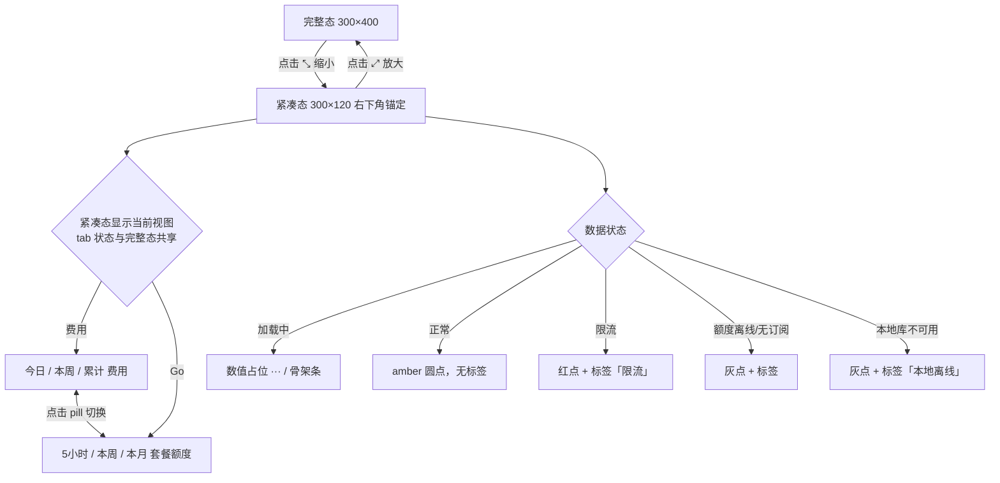
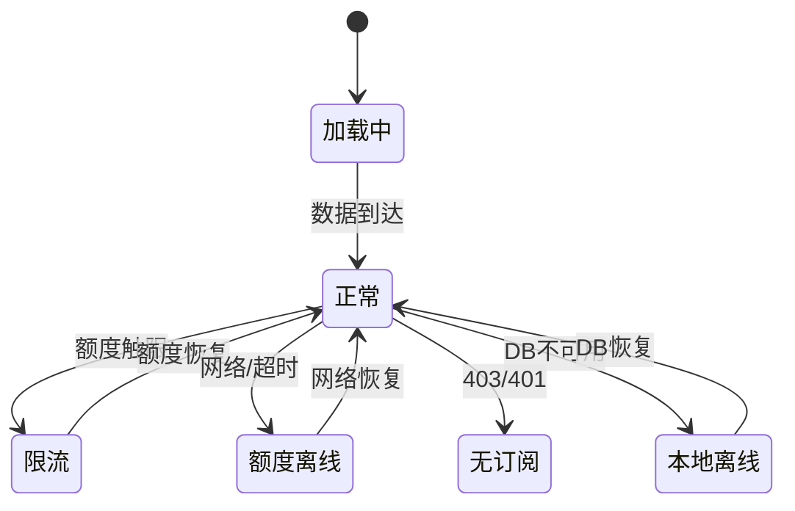

# 产品需求文档：OpenCode 用量小窗口·紧凑模式 - V0.3

## 1. 综述 (Overview)

### 1.1 项目背景与核心问题

桌面小窗口（300×400）常驻屏幕右下角，信息完整但占屏明显。用户日常多数时候只想"瞄一眼"今日费用或套餐额度，不需要图表、Top3 模型/项目等明细。需要一个更小的常驻形态，在不丢关键数字的前提下把窗口收成一条迷你面板。

### 1.2 核心业务流程 / 用户旅程地图

1. **阶段一：紧凑态进出** — 一键在 300×400 ↔ 300×120 之间切换，右下角锚定不动
2. **阶段二：紧凑态内容查看** — 在紧凑窗口内切换查看「费用（今日/本周/累计）」或「Go 套餐额度（5小时/本周/本月）」
3. **阶段三：紧凑态状态与边界** — 加载/降级/限流的顶栏状态表达 + 数值与文本边界

### 1.3 Mermaid 图（流程/状态）

#### 1.3.1 用户操作流（必填）



#### 1.3.2 状态机（紧凑态数据状态）



---

## 2. 用户故事详述 (User Stories)

### 阶段一：紧凑态进出

---

#### **US-01: 作为小窗口用户，我希望一键缩小/放大窗口，以便在"完整详情"和"迷你常驻"间快速切换。**

*   **价值陈述 (Value Statement)**:
    *   **作为** 桌面小窗口用户
    *   **我希望** 一键在完整视图（300×400）和紧凑视图（300×120）间切换
    *   **以便于** 在需要详细信息时看全貌，在日常使用时只占最小面积

*   **业务规则与逻辑 (Business Logic)**:
    1.  **前置条件**: 小窗口已启动并显示
    2.  **操作流程 (Happy Path)**:
        1. 点击顶栏缩小按钮（位于刷新按钮左侧）→ 窗口从 300×400 收到 300×120
        2. 缩小后按钮变为放大图标，再点一次恢复 300×400
        3. 缩放锚定右下角：左/上边缘内收，右下角位置不动（clamp 到屏幕 workArea）
        4. tab 状态（费用/Go）在两种模式间共享
    3.  **异常处理 (Error Handling)**:
        *   屏幕可用区不足 → 缩放锚点 clamp 到 workArea 内，窗口不越出屏幕
        *   缩小/放大瞬间 → 无过渡动画，内容即时切换
        *   重启 → 回到完整视图（不持久化缩小状态）

*   **验收标准 (Acceptance Criteria)**:
    *   **场景1: 缩小**
        *   **GIVEN** 窗口处于完整态 300×400
        *   **WHEN** 点击缩小按钮
        *   **THEN** 窗口变为 300×120，右下角位置不变，按钮图标变为放大
    *   **场景2: 放大**
        *   **GIVEN** 窗口处于紧凑态 300×120
        *   **WHEN** 点击放大按钮
        *   **THEN** 窗口恢复 300×400，右下角位置不变，按钮图标变为缩小
    *   **场景3: tab 共享**
        *   **GIVEN** 完整态切到 Go tab
        *   **WHEN** 点击缩小
        *   **THEN** 紧凑态显示 Go 视图

---
*   **页面布局线框图 (ASCII Wireframe)**:
    ```text
    完整态 (300×400)                    紧凑态 (300×120)
    ┌──────────────────────────┐       ┌──────────────────────────┐
    │ ● OpenCode 用量          │       │ ● OpenCode               │
    │ [费用|Go]  ⤡ ↻ ✕        │ ←→   │ [费用|Go]  ⤢ ↻ ✕        │
    ├──────────────────────────┤       ├──────────────────────────┤
    │ (完整内容)                │       │ (当前视图内容)            │
    │ ...                      │       └──────────────────────────┘
    └──────────────────────────┘         ↑ 右下角锚定不动
    ```

---

### 阶段二：紧凑态内容查看

---

#### **US-02: 作为小窗口用户，我希望紧凑态下查看今日/本周/累计费用，以便快速掌握花费概况。**

*   **价值陈述 (Value Statement)**:
    *   **作为** 桌面小窗口用户
    *   **我希望** 紧凑态费用视图显示三个核心费用数字
    *   **以便于** 一眼看清今日、本周、累计花了多少

*   **业务规则与逻辑 (Business Logic)**:
    1.  **前置条件**: 窗口处于紧凑态且当前 tab 为"费用"
    2.  **操作流程 (Happy Path)**:
        1. 显示三行清单：label 左（今日/本周/累计）、数值右对齐
        2. 今日 / 本周：数值 mono 14px，--fg 色
        3. 累计：数值 mono 14px，--amber 色（突出显示）
        4. label：11px，--fg-3 色，letter-spacing 0.14em
    3.  **异常处理 (Error Handling)**:
        *   加载中 → 数值显示 `···`（--fg-4 色）
        *   DB 不可用 → 数值显示 `—`
        *   0 值 → 显示 `$0.00`（不是 —）
        *   极大值 → en-US 千分位格式（如 `$12,345.67`）

*   **验收标准 (Acceptance Criteria)**:
    *   **场景1: 正常显示**
        *   **GIVEN** 窗口紧凑态费用视图，数据已加载
        *   **THEN** 显示三行：今日 $X.XX / 本周 $X.XX / 累计 $X.XX（累计 amber）
    *   **场景2: 加载中**
        *   **GIVEN** 窗口紧凑态费用视图，数据未到达
        *   **THEN** 三行数值均显示 `···`
    *   **场景3: 极大值**
        *   **GIVEN** 累计费用 $12,345.67
        *   **THEN** 显示 `$12,345.67`（千分位分隔，tabular nums 对齐）

---
*   **页面布局线框图 (ASCII Wireframe)**:
    ```text
    ┌──────────────────────────────┐
    │ ● OpenCode                    │
    │ [费用|Go]  ⤢ ↻ ✕             │
    ├──────────────────────────────┤
    │ 今日                  $1.23   │
    │ 本周                  $8.45   │
    │ 累计                $167.54   │ ← amber
    └──────────────────────────────┘
    ```

---

#### **US-03: 作为小窗口用户，我希望紧凑态下查看套餐额度（5小时/本周/本月），以便快速掌握 Go 套餐健康度。**

*   **价值陈述 (Value Statement)**:
    *   **作为** 桌面小窗口用户
    *   **我希望** 紧凑态 Go 视图显示三个额度窗口的百分比和进度条
    *   **以便于** 一眼看清哪个额度最紧张

*   **业务规则与逻辑 (Business Logic)**:
    1.  **前置条件**: 窗口处于紧凑态且当前 tab 为"Go"
    2.  **操作流程 (Happy Path)**:
        1. 显示三行网格：label（34px）/ 进度条（4px bar + violet 渐变）/ 百分比（40px mono）/ 重置时间（64px mono）
        2. 三窗口：5小时 / 本周 / 本月
        3. 百分比色阶：<50% violet / 50-80% warn(amber) / ≥80% danger(red) / rate-limited=100% red
        4. 重置时间简写：2h11m / 09-14 / 10-01
    3.  **异常处理 (Error Handling)**:
        *   加载中 → 百分比显示 `···`，进度条骨架闪烁
        *   额度不可用（网络）→ 整体降级为单行 "额度数据不可用 · 点 ↻ 重试"
        *   无订阅 → 显示 "无 opencode-go 凭据"
        *   限流 → 最紧张行变红，进度条 100%

*   **验收标准 (Acceptance Criteria)**:
    *   **场景1: 正常显示**
        *   **GIVEN** 窗口紧凑态 Go 视图，额度数据已加载
        *   **THEN** 三行显示 5小时/本周/本月 的进度条+百分比+重置时间
    *   **场景2: 限流**
        *   **GIVEN** 5小时窗口触发限流
        *   **THEN** 5小时行变红，百分比显示 100%，进度条红色
    *   **场景3: 额度不可用**
        *   **GIVEN** 网络错误导致额度数据不可用
        *   **THEN** 三行替换为 "额度数据不可用 · 点 ↻ 重试"

---
*   **页面布局线框图 (ASCII Wireframe)**:
    ```text
    ┌──────────────────────────────────┐
    │ ● OpenCode                        │
    │ [费用|Go]  ⤢ ↻ ✕                 │
    ├──────────────────────────────────┤
    │ 5小时  ▓▓▓▓▓░░░░░  42%  2h11m   │
    │ 本周   ▓▓░░░░░░░░  18%  09-14   │
    │ 本月   ▓▓▓▓▓▓░░░░  63%  10-01   │
    └──────────────────────────────────┘
    ```

---

#### **US-04: 作为小窗口用户，我希望紧凑态下切换费用/Go tab，以便在同一小窗口内查看不同类型的数据。**

*   **价值陈述 (Value Statement)**:
    *   **作为** 桌面小窗口用户
    *   **我希望** 紧凑态保留两个 tab pill 可点击切换
    *   **以便于** 不放大窗口就能在费用和 Go 之间切换

*   **业务规则与逻辑 (Business Logic)**:
    1.  **前置条件**: 窗口处于紧凑态
    2.  **操作流程 (Happy Path)**:
        1. 点击费用 pill → 显示费用三行清单
        2. 点击 Go pill → 显示 Go 三行额度
        3. tab 状态与完整态共享（完整态切到 Go 后缩小，紧凑态仍显示 Go）
        4. 切换 tab 时窗口尺寸和位置不变
    3.  **异常处理 (Error Handling)**:
        *   无（tab 切换纯前端，不涉及网络）

*   **验收标准 (Acceptance Criteria)**:
    *   **场景1: 切换 tab**
        *   **GIVEN** 紧凑态费用视图
        *   **WHEN** 点击 Go pill
        *   **THEN** 视图切换为 Go 额度，窗口尺寸不变
    *   **场景2: 状态共享**
        *   **GIVEN** 完整态已切到 Go tab
        *   **WHEN** 点击缩小
        *   **THEN** 紧凑态显示 Go 视图（不是费用）

---
*   **页面布局线框图 (ASCII Wireframe)**: 同 US-02/US-03，tab pill 位于 header 品牌右侧。

---

### 阶段三：紧凑态状态与边界

---

#### **US-05: 作为小窗口用户，我希望紧凑态能表达数据状态（加载/正常/限流/降级），以便了解当前数据是否可靠。**

*   **价值陈述 (Value Statement)**:
    *   **作为** 桌面小窗口用户
    *   **我希望** 紧凑态通过顶栏圆点颜色和条件小标签表达状态
    *   **以便于** 不占行高就能知道数据是否正常/限流/离线

*   **业务规则与逻辑 (Business Logic)**:
    1.  **前置条件**: 窗口处于紧凑态
    2.  **状态映射**:
        *   加载中 → amber 圆点（默认脉动），无标签，数值 `···`
        *   正常 → amber 圆点，无标签
        *   限流 → 红色圆点（停止脉动）+ 标签「限流」红色，tooltip: "Go 已达 {窗口}上限 · 重置后自动恢复 · 期间可切免费模型（opencode/*）"
        *   额度不可用（网络/超时）→ 灰色圆点 + 标签「额度离线」，tooltip: "无法连接 opencode.ai · 检查网络后点 ↻ 重试"
        *   无订阅 → 灰色圆点 + 标签「无订阅」，tooltip: "auth.json 中无 opencode-go 凭据，或订阅已过期"
        *   本地库不可用 → 灰色圆点 + 标签「本地离线」，tooltip: "数据库不可用，等待中…（每 30s 重试）"
    3.  **标签样式**: 9px，pill 样式（border-radius 999px）；限流 = 红色；其余 = 灰色
    4.  **无 toast**: 紧凑态不引入 toast；反馈统一走顶栏圆点+标签

*   **验收标准 (Acceptance Criteria)**:
    *   **场景1: 限流状态**
        *   **GIVEN** Go 5小时窗口触发限流
        *   **THEN** 顶栏显示红色圆点 + 标签「限流」，Go 5小时行变红
    *   **场景2: 额度离线**
        *   **GIVEN** 网络错误导致额度不可用
        *   **THEN** 顶栏显示灰色圆点 + 标签「额度离线」，Go 额度区降级
    *   **场景3: hover tooltip**
        *   **GIVEN** 限流状态
        *   **WHEN** 鼠标悬停在「限流」标签上
        *   **THEN** 显示完整 tooltip 文案

---
*   **页面布局线框图 (ASCII Wireframe)**:
    ```text
    正常态:                    限流:                        额度离线:
    ● OpenCode               ● OpenCode 限流               ● OpenCode 额度离线
    (amber dot)              (red dot + red tag)           (gray dot + gray tag)
    ```

---

#### **US-06: 作为小窗口用户，我希望紧凑态能处理边界情况（0值/极大值/长文本），以便界面不会破版。**

*   **价值陈述 (Value Statement)**:
    *   **作为** 桌面小窗口用户
    *   **我希望** 紧凑态在 0 值、极大值、长文本等边界情况下仍正常显示
    *   **以便于** 不会出现文字重叠、截断不全、数值错位等问题

*   **业务规则与逻辑 (Business Logic)**:
    1.  **0 值**: 显示 `$0.00`（不是 —），仅用于正常数据为零的场景
    2.  **极大值**: 保留 en-US 千分位格式（`$12,345.67`），mono + font-feature-settings:"tnum" 1 保证数字等宽对齐
    3.  **长文本截断**: 紧凑态不显示模型名，无截断风险；品牌/标签等过长文本用 text-overflow:ellipsis 省略，悬停由 title 补全
    4.  **数值不可用**: 仅用于数据不可得（DB 不可用/加载中）时显示 —

*   **验收标准 (Acceptance Criteria)**:
    *   **场景1: 0 值**
        *   **GIVEN** 今日费用为 0
        *   **THEN** 紧凑态显示 `$0.00`（不是 —）
    *   **场景2: 极大值**
        *   **GIVEN** 累计费用 $12,345.67
        *   **THEN** 显示 `$12,345.67`，千分位分隔，数字列对齐
    *   **场景3: 长品牌名**
        *   **GIVEN** 品牌名为 "OpenCode Usage Widget"
        *   **THEN** 显示 "OpenCode Usa..." 省略号截断，hover 显示完整

---
*   **页面布局线框图 (ASCII Wireframe)**: 同 US-02/US-03，边界值在相同位置替换。

---

## 附录

### 设计参考文件

- `设计/v0.3-compact/需求总结.md` — 背景、目标、功能范围、关键决策
- `设计/v0.3-compact/compact-设计稿.html` — 完整态 + 紧凑态 HTML mockup
- `设计/v0.3-compact/compact-全状态设计参考.html` — S1-S10 全状态 + 反馈规范 + 交互规则表

### 技术约束

- BrowserWindow 300×400、`resizable:false`、右下角锚定 `EDGE_MARGIN=16`
- 新增 IPC `setCompact(bool)`，main 用 `setBounds` 重算右下角锚点
- 现有 5 个 `window.widget` 桥方法签名不可改，只增量新增
- CSP `default-src 'self'`，禁内联脚本，逻辑进 `renderer.js`
- 零依赖，不引入持久化
- 视觉沿用现有 dark glass tokens，新类加 `compact-` 前缀
